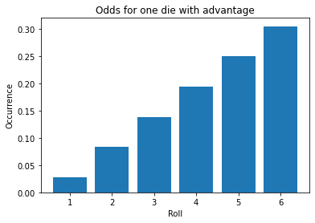
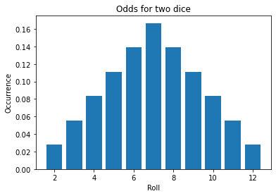
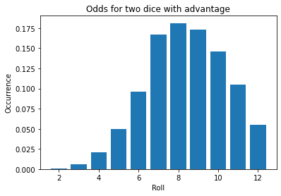

# Dice Roll Odds
This is a short excursion about odds and dice rolls.

## Jupyter Notebook
For implementing the algorithms calculating the results I used Python embedded in a [Jupyter Notebook](https://jupyter.org/). 

## Results

 

 

